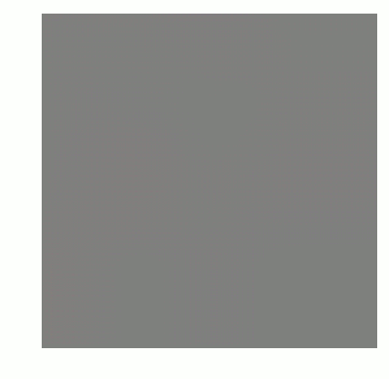
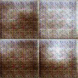
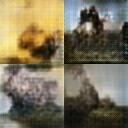
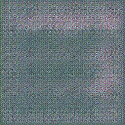
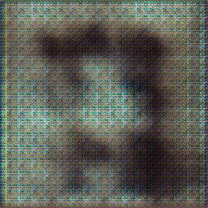

# artGAN
Keras-based implementation of a Deep Convolutional Generative Adversarial Network, based on code from [Robbie Barrat](https://github.com/robbiebarrat/art-DCGAN), [Soumith Chintala](https://github.com/soumith/dcgan.torch), and [Felix Mohr](https://github.com/FelixMohr/Deep-learning-with-Python/blob/master/DCGAN-MNIST.ipynb). 

## Getting Started

[kerasGANv8.py](scripts/kerasGANv8.py) supports command line arguments.

```
usage: kerasGANv8.py [-h] --batchSize BATCHSIZE [--noiseSize NOISESIZE]
                     [--yDim YDIM] [--xDim XDIM] [--outputDir OUTPUTDIR]
                     [--trainingDir TRAININGDIR]

optional arguments:
  -h, --help            show this help message and exit

required arguments:
  --batchSize BATCHSIZE
                        batch size
  --noiseSize NOISESIZE
                        size of noise input
  --yDim YDIM           input y dimension
  --xDim XDIM           input x dimension
  --outputDir OUTPUTDIR
                        where to save generated imgs
  --trainingDir TRAININGDIR
                        training imgs directory
```
If training on a CPU, I've found the following options productive:
```
python3 kerasGANv8.py --xDim=64 --yDim=64 --batchSize=4 --noiseSize=4 --outputDir=[your/desired/output/directory] --trainingDir=[directory/with/training/imgs]
```


### Dependencies

```
tensorflow
keras
numpy
matplotlib
scipy
```

### Installing

Use [install_dependencies.sh](scrips/install_dependencies.sh) to prepare.

```
./install_dependencies.sh
```

### Usage

```
python3 kerasGANv8.py
```

* Change the options for x_dim, y_dim, trainingDir, and outputDir to match your training images and desired output location.

* Adjust the batch size and noise size to the speed at which you want to your model to learn. This is very dependent on how powerful your computer is. 

* These files are intended for CPU training only.

### Tips
* For images with dimensions 256x256, having ngf=100 and ndf=15 has been optimal.
* For images with dimensions 128x128 or 64x64, having ngf=160 and ndf=20 to 40 has been optimal.

### Examples of output images and their training periods
#### [MNIST](scripts/gan128MNIST.py) Training


#### MNIST Final Output - 2900 training epochs


#### [128x128px Paintings](scripts/gan128Paintings.py) Training

#### 128x128px Paintings Final Output - 9300 training epochs


#### [256x256px Impressionist](scripts/gan256Impres.py) Training

#### 256x256px Impressionist Final Output - 14740 training epochs


#### [512x512px Paintings](scripts/gan512.py) Training

#### 512x512px Paintings Final Output - 510 training epochs


#### [256x256px Chuck Close](scripts/ganChuck256.py) Artwork Training

#### 256x256px Chuck Close Final Output - 1200 training epochs


#### [kerasGANv1](scripts/kerasGAN.py) Training

#### kerasGANv1 Final Output - 4900 training epochs


#### Output from [emulating work](scripts/256mainv2.lua) by [Robbie Barrat](https://github.com/robbiebarrat/art-DCGAN) and [Soumith Chintala](https://github.com/soumith/dcgan.torch)

#### Final Output - 54 training epochs


#### More output from [my adaptation of main.lua](scripts/256mainv2.lua)

#### Final Output - 1 training epoch (3602 training steps)


## Summary of Results
My homemade revision of the neural network sequential structure that [Soumith Chintala](https://github.com/soumith/dcgan.torch) developed failed to produce high-quality images. I was able to get interesting results, but I would not classify the images my code generated as "artwork". 

The slightly [modified version](scripts/256mainv2.lua) of [Barrat's code](https://github.com/robbiebarrat/art-DCGAN) did produce cool results. The [64x64px generated landscapes](readmeImages/stills/256mainv2Epoch54.jpg) came out [cool.](readmeImages/gifs/256mainv2.gif) The [256x256px generated portraits](readmeImages/stills/portrait256main.jpg) also came out [cool.](readmeImages/gifs/portrait256main.gif) 

I am hoping to continue work on this, and eventually produce realistic artwork with my own revisions of [Robbie Barrat's](https://github.com/robbiebarrat/art-DCGAN) and [Soumith Chintala's](https://github.com/soumith/dcgan.torch) code.

### Future Work

* adapt for GPU calculations

## Authors

* **Lucas Lyon** - [lalyon](https://github.com/lalyon)


## Acknowledgments
Shoutout to the following people, whose code was invaluable while developing these neural networks.

* [Robbie Barrat](https://github.com/robbiebarrat/art-DCGAN)
* [Soumith Chintala](https://github.com/soumith/dcgan.torch)
* [Felix Mohr](https://github.com/FelixMohr/Deep-learning-with-Python/blob/master/DCGAN-MNIST.ipynb). 


